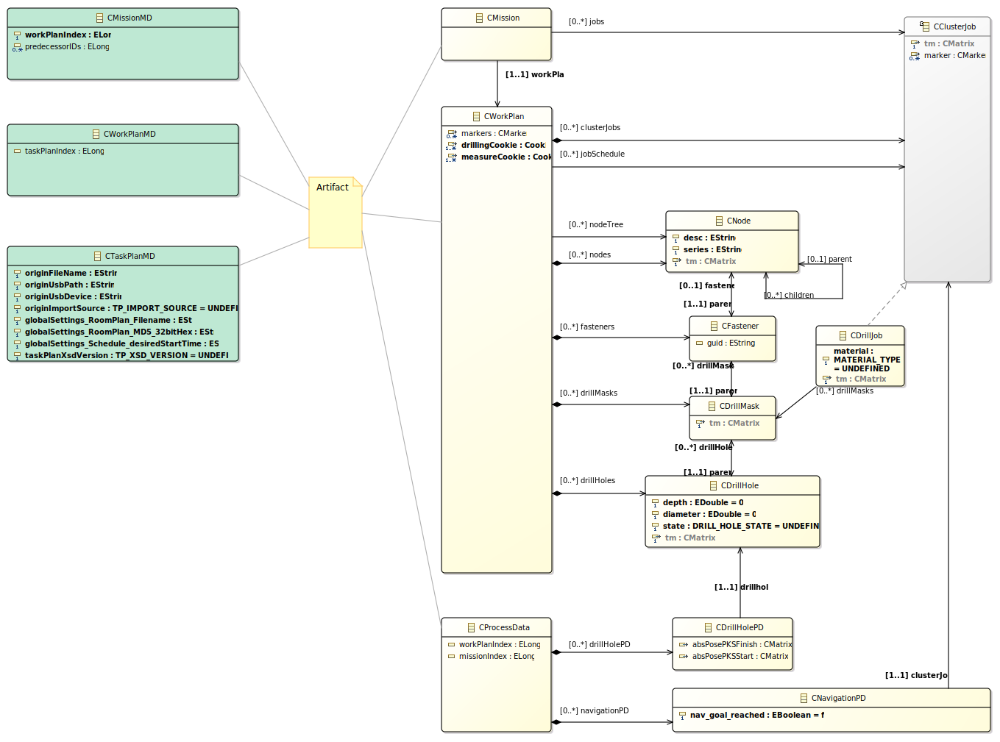

################################
Package ``ccu_bautiro``
################################

.. attention:: Supports: **Taskplan 2.0**

.. attention::
  | This package is generated code.
  | ``do_codegen.bash`` creates the package code. ``readme.md`` describes codegen.

Context via Dependencies
  | ``ccu_bautiro`` is a a plain data-model with no function implementation.
  | Its model elements are use by:

  - :doc:`../../ccu_dataservice/doc/ccu_dataservice`
  - :doc:`../../ccu_data_services/doc/ccu_data_services`
  - :doc:`../../ccu_hcu_abstraction/doc/ccu_hcu_abstraction`

  It uses, thus depends on `pyecore <https://pypi.org/project/pyecore/>`_.

.. uml:: img/ccu_bautiro_context_dependencies.puml

Introduction
  The ``Taskplan.xml`` file - according to  schema defined
  in `BIMConnector <https://sourcecode.socialcoding.bosch.com/projects/BAUTIRO/repos/bautiro_common/browse/BIMConnector>`_
  is the interface artifact.
  The internal data-model is another.
  The package and model name is ``ccu_bautiro``.

Description
  - The counterpart of a ``TaskPlan`` is a ``WorkPlan``.
    It has same meaning,
    with small changes in containment/linking structure,
    to achieve faster traverse at runtime.
  - ``Taskplan`` is loaded by  ``Loader`` of ``CDataService`` into ``WorkPlan``.
  - ``Mission``- Element is defined by  *Taskplan-Jobs*
  - Model ``CBautiro`` is defined in `ccu_bautiro.ecore <https://sourcecode.socialcoding.bosch.com/projects/BAUTIRO/repos/ccu_data_services/browse/ccu_bautiro/model/ccu_bautiro.ecore>`_

