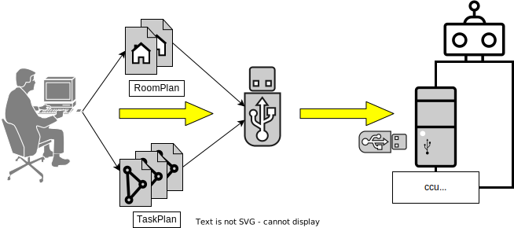
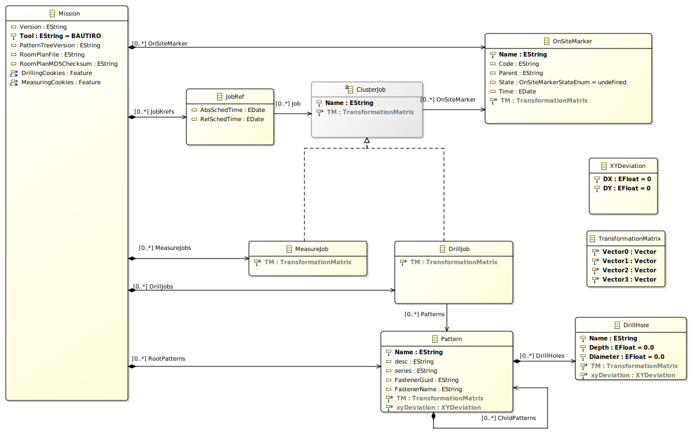

#############################################
**Concept** - mission data and folders
#############################################

.. raw:: html

    

.. role:: red

----

.. contents:: Contents
  :local:

----

.. note:: Story - content

   **Gesamtkonzept Datenverwaltung für CCU/Bautiro erforderlich:**
      - *DONE: Taskplan*
      - Missionsplan relevante Daten
      - Dynamische Daten (z.B: Roboter Bewegung Daten, Sensor Daten, ...)
      - Bautiro Parameters

    #. | **Termin CCU**
       | innere Struktur (Ordner, Artefakte, Datenbanken, etc) Dokumentation und Klassendiagramm

    #. | **Termin CCU + HCU**
       | Schnittstellen nach außen (HCU) Teil 4
       | Schnittstellen nach innen FPM/RPM (Services)

*******
Prologe
*******

In the following text a concept is described
how operators of BAUTIRO bring in
a new "Job", or "Task-Description"
during a day at the construction site.

As planned of today, physically, the operator plugs in
an USB stick (Pen-Drive) or memory/SD-card
into BAUTIRO Control Unit (or HMI Device).  \
Then operator get's asked *"wich Job"*
to take up means *"copy from USB to BAUTIRO"*.

Under the hood:  \
*'the right'* file-artifacts get copied from *source* location,
to a destination folder on BAUTIRO.

This concept deals with

#. where exactly are the folders
   - folder-names
   - how to handle same file/job copied again
#. transferring, loading, copying files
#. Loading Taskplan into Domain-Data-Model
#. Persisting Domain-Data-Model in SQLite (call it ``Mission``)

.. _workflow:

*****************************************
**Workflow**
*****************************************

From User Journey Perspective following activities
shall introduce terminology of **TaskPlan** and **Mission**

.. uml:: img/concept/ccu_data_workflow.puml

***************************************
User Interface Artifacts
***************************************

For automated operation, input to (CCU) BAUTIRO
are basically following **2** artifacts:

``RoomPlan.obj``
     Intended to be used by Localization (SLaM)
     to find out where BAUTIRO is.

``TaskPlan.xml``
  Contains semantically input to create
  what is further called ``Mission``.

  We get from it:

    - The **Markers**
    - | The pre-planed **PathPlan** of BAUTIRO.
      | In ``TaskPlan.xml`` this is designed as
        an ordered list of ``Jobs`` at a ``Clusters``
      | *(Cluster: deutsch in etwa "Stützstelle" oder
        "Arbeitsraum" an der Decke)*
    - | **Pattern**\ s (containing Patterns, containing ...)
      | Where every Pattern contains the **DrillHole**\ s

.. figure:: img/concept/ccu_data_handling_folder_concept_1.drawio.svg
    :scale: 66%
    :align: center

    TaskPlan/RoomPlan-content semantically visualized

*****************************************
**Workflow** - Transfer Taskplan
*****************************************

| Part of the Workflow is to Transfer
  the interfacing Artifacts to BAUTIRO.
| *Users* or *Operators*  have to deal with
  Taskplan ( and RoomPlan) files.

.. rubric:: Assumption: USB PenDrive as intermediate Storage

    Illustrating graphic

In UML this would be following:

.. list-table::
   :header-rows: 0

   * - .. centered:: Activity Diagram
     - .. centered:: Deployment Diagram
   * - .. uml:: img/concept/ccu_taskplan_copy_1_activity.puml
     - .. uml:: img/concept/ccu_taskplan_copy_2_deployment.puml

***************************************
Folder Structure
***************************************

Basic concept is shown in the following Deployment Diagram:

.. uml:: img/concept/ccu_data_folders_for_taskplan_and_databases.puml

.. warning::

   | Access and identity Management (**AIM**):
   | Based on existing user concept,
   | Files and folders are owned by:

     -  **user** ``bautiro``
     -  **id** e.g. ``1001`` (?) -  :red:`t.b.d. !!!`

   File storage in **Linux-FSH** for simplicity:

     - ``/home/bautiro/data``

   .. note::

      Usually for applications, data is stored at

      -  ``/opt/bautiro/.....``
      -  ``/var/bautiro/data``

***************************************
``metadata.ini``
***************************************

When user interacts in the HCU-UI-Dialog and transfers/copies
a certain ``<taskplan>.xml`` to bautiro then metadata (like date-time)
is stored in same folder in file ``metadata.ini``

.. note::

  using ``ini`` file format because

  - light weight
  - dis-coupling from other data-formats (like XML, SQL, JSON)
  - has huge Library support `INI file - Wikipedia <https://en.wikipedia.org/wiki/INI_file>`_
  - simple usage ``KEY : Value`` DataBase (supporting Lists as Values)
  - Human Readable and EDITABLE

.. list-table::
   :header-rows: 0

   * - .. centered:: UML
     - Content
   * - .. uml:: img/concept/ccu_data_ini_file_along_taskplan.puml
     - .. code-block:: ini

          [taskplan]
          ; wie heißt die Datei
          id = 3 ; id = Ordner-Name
          name = "taskplan1.xml" ; unchanged from original file-name
          md5_checksum_hex = "17B238E7FHE9D90934" ; calculated on import
          date_time_of_creation = 2023-03-07T15:22:46Z

          [origin]
          ; woher kommt die Datei ursprünglich
          source-path = "/media/bautiro/Toshiba-USB-16GB/Projekt Österlin/Edit Final/taskplan1.xml"
          usb-device-name = "Toshiba-USB-16GB"
          device = "/dev/sdc"
          mount-point = "/media/bautiro/Toshiba-USB-16GB" ; ubuntu udev style
          md5_checksum_hex = "undefined"

          [roomplan]
          ; mit welchem Raumplan ist der Taskplan verknüpft
          id = 2
          md5_checksum_hex = "17B238E7FHE9D90934"

.. list-table::
   :header-rows: 0

   * - .. centered:: UML
     - .. centered:: Content
   * - .. uml:: img/concept/ccu_data_ini_file_along_roomplan.puml
     - .. code-block:: ini

         [roomplan]
         ; wie heißt die Datei
         id = 3 ; id = Ordner-Name
         name = "kindergarden_3rd_floor.obj" ; unchanged from original file-name
         md5_checksum_hex = "1A2BF4C" ; calculated on import

         [origin]
         ; woher kommt die Datei ursprünglich
         source-path = "/media/bautiro/Toshiba-USB-16GB/Projekt Österlin/Kindergarten/Räume/kindergarden_3rd_floor.obj"
         usb-device-name = "Toshiba-USB-16GB"
         device = "/dev/sdc"
         mount-point = "/media/bautiro/Toshiba-USB-16GB" ; ubuntu udev style
         md5_checksum_hex = "undefined"

         [taskplan]
         ; mit welchen Taskplans ist dieser Raum verknüpft
         id = [2,3] ; hier im Beispiel "taskplan1.xml" und "taskplan2.xml"

The directory tree looks like this:

.. code-block:: text

   /home/bautiro/
         └── data/
             ├── missions/
             │   ├── 1/
             │   │   └── .....
             │   └── 2/
             │   │   └── .....
             ├── roomplans/
             │   ├── 1/
             │   │   │── metadata.ini
             │   │   └── theater_1st_floor.obj
             │   └── 2/
             │       ├── metadata.ini
             │       └── kindergarden_3rd_floor.obj
             └── taskplans/
                 ├── 1/
                 │   ├── metadata.ini
                 │   └── othertaskplan.xml
                 ├── 2/
                 │   ├── metadata.ini
                 │   └── taskplan1.xml
                 └── 3/
                     ├── metadata.ini
                     └── taskplan1.xml

.. caution::

   **2 Taskplan refer 1 RoomPlan**

   In case the same **RoomPlan** is referred by 2 **TaskPlans**,
   the (2 linked) roomplans are checked to be *identical*.

   In case they are identical,
   then only one RoomPlan is required to be stored.
   Relevant relationship-data can be stored via ``metadata.ini``.

   .. danger::
      | Was bedeutet :red:`identisch` bei einem Raumplan
      | Annahme:

      1. binär-identisch
      2. | identischer dateiname - (Pfad irrelevant)
         | Unterschiedliche Pfade sollen im ``metadata.ini`` unter origin
           hinzugefügt werden,
         | z.b. als source_path_alt [ "pfad2", "pfad3 ]

   .. hint::

      | :red:`➔ TODO 1`:  > Status Quo - falls Raumplan:
      | :red:`binär identisch`  mit :red:`unterschiedlichem Dateinamen`
        ➔ wird als '*anderer/neuer*' Raum gehandhabt.
      | Das scheint inkonsistent zu oben beschriebenem Verhalten.
      | Zielt auf die Autonomie des Benutzers ab,
      | der mit neuem Datei-Namen, nochmal neu beginnen kann.
      | :red:`➔ TODO 2`:
        Warnung an USER falls er identische **'Räume doppelt'** hat bzw. anlegt.
      | :red:`➔ TODO 3`:
        Warnung an USER falls er identische **'TaskPläne doppelt'** hat bzw. anlegt.

**********************************
Missions
**********************************

A Mission is the living counterpart of a TaskPlan.

We treat Taskplan as an **immutable** Object (*Read Only*).
A Mission is created from a Taskplan.
A Mission contains same information as a Taskplan - and more. It is a superset.
Mission will also keep e.g. the status of every Drill-Hole (done, failed, to be drilled, ...)
and store additional Information over Time.

.. hint::

  Eine Mission ist als eher "statisch" zu lesen.
  Alle Missions-teile sind zwar durchaus veränderbar.
  Jedoch sind Dinge wie  "Logging" und "Auftretenden Fehler" hoch-dynamisch,
  Und auch das zusammen-führen verschiedener Dinge aus dem ROS
  Eco-System ist noch im entstehen.

.. rubric:: Mission Creation

********************************************
**Workflow** - Initial Mission Creation
********************************************

  | is from data point of view an instantiation of a Database
  | that contains Taskplan content (and more).

  .. uml:: img/concept/ccu_data_mission_do_create_01.puml

Looking at it *"Straight Forward"* - according
to our :ref:`Workflow` we would at some point
start Mission Execution -
make some progress - have pause until next day - and continue Mission execution.

Continuation of *same* Mission
  .. uml:: img/concept/ccu_data_mission_do_create_02a.puml

.. caution::

  It needs to be considered  that missions can be instantiated
  a second time *-or-* from a an existing Mission,
  that has already made progress towards being finished.

************************
Derived Mission Creation
************************

Create *new* Mission from partly-done Mission
  .. uml:: img/concept/ccu_data_mission_do_create_02b.puml

Create *new* Mission from Taskplan intentionally
  .. uml:: img/concept/ccu_data_mission_do_create_02c.puml

**********************
Loading & Persisting
**********************

On initial creation of a Mission,
a DOM (Domain Object Model)
is used to load Taskplan
and persist it as SQLite database file.

 .. uml:: img/concept/ccu_data_mission_instantiation_persisting.puml

**********************
Bautiro Domain Model
**********************

`bautiro_common/bautiro\_domain_model/model <https://sourcecode.socialcoding.bosch.com/projects/BAUTIRO/repos/bautiro_common/browse/bautiro_domain_model/model>`_
  is where current Domain Model is hosted.
  next to `TaskPlan-1.5.XSD` definition

****************************
Loading & Service Offering
****************************

Whenever BAUTIRO gets turned off-and-on again,
an active Mission must be available in form of
(ROS) Services.
These services use again the DOM
and the underlying SQLite database persistency.

 .. uml:: img/concept/ccu_data_mission_loading_service_offering.puml

****************************
Changing Model
****************************

***********************************
**Workflow** - Mission Edit by User
***********************************

Editing Missions by USer from HCU is reflected in following activity Diagramm.

.. uml:: img/concept/ccu_data_workflow_edit_mission.puml

Editing Missions is for simplicity and safety, realized in a *"Working Copy"* perspective.

Assuming a chain of Editing steps, the deployed persistency
shall be store the whole new Mission like this:

**Preferred start:**

.. uml:: img/concept/ccu_data_mission_edit_01.puml

.. note::

   optimizations regarding disk-space or better **un-do** feature can be realized still Later on.

***********************************
Hardware / OS Constraints
***********************************

File System
  Allowed file systems for the used USB-Stick:  ``FAT32``, ``NTFS``, ``ext4``

File Name Conventions
    - ``[-a-zA-Z0-9._]_taskplan.xml``
    - ``[-a-zA-Z0-9._]_roomplan.xml``
    - ``[-a-zA-Z0-9._].obj``
