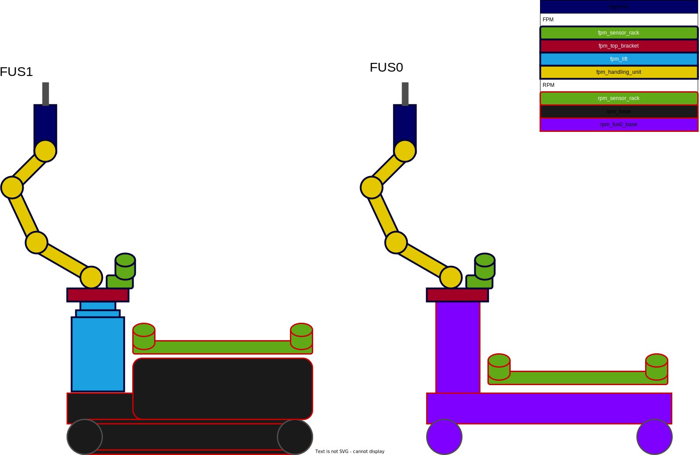

# BAUTIRO

[](https://github.boschdevcloud.com/BAUTIRO/bautiro/actions/workflows/build.yml)

This is the Bautiro meta-package, it refrences all required packages to run the bautiro simulation and real robot.

##ROS packages:##

### [bautiro_bringup](bautiro_bringup/README.MD) package

Contains launchfiles to start the bautiro incl. configuration files.

### [bautiro_description](bautiro_description/README.MD) package

Contains urdf files merging the robot description from the submodules. For each submodule a dedicated urdf file exists. Boxes with red frames belongs to the RPM, blue frames refers to the FPM.fd  


### [bautiro_gazebo_simulation](bautiro_gazebo_simulation/README.MD) package

Contains launchfiles to start the bautiro gazebo simulations and world files 

## Demos/Examples##

- [Gazebo Simulation](doc/demo_manual_simulation.md)
- [Systemdays2022](doc/demo_systemdays2022.md)
----

## Was ist hier?

* Datei [bautiro.repos](bautiro.repos):
  damit könnenmit dem [vcstool](https://github.com/dirk-thomas/vcstool) alle repos gleichzeitig aus
  ge-checked werden.

  ```bash
  # installation
  sudo apt install python3-vcstool # installation

  vcs import src < bautiro.repos # clone repos into 'src'
  vcs custom --args remote update
  vcs pull src # pull all
  vcs export src > my_bautiro.repos # show workspace version
  ```

* \[[ddsconfig](ddsconfig)\] hier liegt das cyclone-dds-config file
* [xsd-files](xsd-files) hier liegen diverse XML-Schema files


## sonst so

> Nicht viel ... ein paar Worte zum setup

Dieses SocialCoding Projekt ist 'closed' und damit
von anderen Bosch-Mitarbeitern nicht einzusehen
  Das kann man unter
[Projekteinstellungen > Projektberechtigungen](https://sourcecode.socialcoding.bosch.com/projects/BAUTIRO/permissions)
ändern!

Dort kann man auch sehen das (aufgrund der SoCo infrastruktur)
zwangsweise angelegten AD Gruppen genutzt werden (sollen)
um dieses SoCo Projekt zu verwalten.

* rb_ci_soco_bautiro_admin_rf
* rb_ci_soco_bautiro_developerwrite_rf
* rb_ci_soco_bautiro_developerread_rf

Ich habe alle bei **rb_ci_soco_bautiro_developerwrite_rf** eingetragen.

Nur Admins können repos anlegen und Löschen. Das war dann auch schon der Unterschied.
  Derzeit sind Heike, Michael Huy und Georg in der Admin Liste.
Wer Admin werden will - einfach Bescheid sagen.

## Wiki

Wir haben auch einen Confluence-Wiki / Docupedia-Bereich unter
  https://inside-docupedia.bosch.com/confluence/display/bautiro/


## Repo struktur

Müssen wir uns noch überlegen,
* Schau mal unter ``doc``
* Aus Gewohnheit hab ich im repo [ccu:com.bosch.bautiro.doc/doc](https://sourcecode.socialcoding.bosch.com/projects/BAUTIRO/repos/ccu/browse/com.bosch.bautiro.doc/doc)
  Ein Teil meiner Documente abgelegt.

   TIP: **VS Code** mit dem **Draw.io** plugin!


