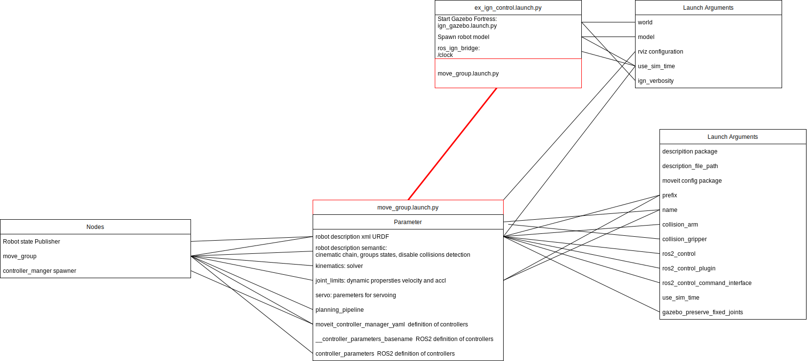

- [1. MoveIt versions](#markdown-header-1-moveit-versions)
  - [1.1. Galactic version (currently used)](#markdown-header-11-galactic-version-currently-used)
  - [1.2. Humble version](#markdown-header-12-humble-version)
- [2. Launch files](#markdown-header-2-launch-files)
  - [2.1. ur\_moveit.launch.py](#markdown-header-21-ur_moveitlaunchpy)
- [3. MOVEIT Configuration (YAML files)](#markdown-header-3-moveit-configuration-yaml-files)
  - [3.1. joint\_limits.yaml](#markdown-header-31-joint_limitsyaml)
  - [3.2. default\_kinematics.yaml](#markdown-header-32-default_kinematicsyaml)
  - [3.3. physical\_parameters.yaml](#markdown-header-33-physical_parametersyaml)
  - [3.4. visual\_parameters.yaml](#markdown-header-34-visual_parametersyaml)
  - [3.5. calibration\_bautiro.yaml](#markdown-header-35-calibration_bautiroyaml)
  - [3.6. calibration\_rpm.yaml](#markdown-header-36-calibration_rpmyaml)
  - [3.7. calibration\_fpm.yaml](#markdown-header-37-calibration_fpmyaml)
  - [3.8. controllers.yaml](#markdown-header-38-controllersyaml)
  - [3.9. kinematics.yaml](#markdown-header-39-kinematicsyaml)
  - [3.10. ompl\_planning.yaml](#markdown-header-310-ompl_planningyaml)
  - [3.11. ur\_servo.yaml](#markdown-header-311-ur_servoyaml)
- [4. SRDF and URDF](#markdown-header-4-srdf-and-urdf)
  - [4.1. SRDF](#markdown-header-41-srdf)
- [5. FIXME: Are information below correct?](#markdown-header-5-fixme-are-information-below-correct)
  - [5.1. Documentation](#markdown-header-51-documentation)
  - [5.2. How to run](#markdown-header-52-how-to-run)

# 1. MoveIt versions

## 1.1. Galactic version (currently used)

- We are using version stored on the SocialCoding: https://sourcecode.socialcoding.bosch.com/projects/BAUTIRO_3RD_PARTY/repos/moveit2/browse
- FIXME: In version that we are using some bug-fix by Stogl is added. I could not find that (Sinisa).

## 1.2. Humble version

TBD

# 2. Launch files

- ur_moveit.launch.py - main launch file for moveit. It is used on the real system.
- ur_moveit_rviz.launch.py - Starts only rviz with moveit plugin.
- fpm_sim_moveit.launch.py - FPM simulation.

## 2.1. ur_moveit.launch.py

This is the main launch file. The following nodes are launched:
- move_group node (package:moveit_ros_move_group)
- mongodb node (package:warehouse_ros_mongo)
- rviz node (package:rviz2)

# 3. MOVEIT Configuration (YAML files)

Configuration of the moveit is done in launch time by providing the config files. Some config files are stored in the config folder, other are pulled from dependencies. Used config files are described below.

| Configuration files       | Path                          | Description |
|---------------------------|-------------------------------|-------------|
|joint_limits.yaml          | package: ur_description       |[link](#31-joint_limitsyaml)|
|default_kinematics.yaml    | package: ur_description       |[link](#32-default_kinematicsyaml)|
|physical_parameters.yaml   | package: ur_description       |[link](#33-physical_parametersyaml)|
|visual_parameters.yaml     | package: ur_description       |[link](#34-visual_parametersyaml)|
|calibration_bautiro.yaml   | package: bautiro_description  |[link](#35-calibration_bautiroyaml)|
|calibration_rpm.yaml       | ?                             |[link](#36-calibration_rpmyaml)|
|calibration_fpm.yaml       | package: fpm_description      |[link](#37-calibration_fpmyaml)|
|controllers.yaml           | ./config                      |[link](#38-controllersyaml)|
|kinematics.yaml            | ./config                      |[link](#39-kinematicsyaml)|
|ompl_planning.yaml         | ./config                      |[link](#310-ompl_planningyaml)|
|ur_servo.yaml              | ./config                      |[link](#35-ur_servoyaml)|

## 3.1. joint_limits.yaml
Parametrization of the joints. This file is contained in the the UR driver package. Example of the parameters:

    houlder_pan_joint:
        # acceleration limits are not publicly available
        has_acceleration_limits: true
        has_effort_limits: true
        has_position_limits: true
        has_velocity_limits: true
        max_effort: 330.0
        max_position: !degrees  360.0
        max_velocity: !degrees  120.0
        max_acceleration: !degrees  120.0
        min_position: !degrees -360.0

## 3.2. default_kinematics.yaml
Defines length of the segments and their orientation. This file is contained in the the UR driver package. Example of the parameters:

    kinematics:
        shoulder:
            x: 0
            y: 0
            z: 0.1807
            roll: 0
            pitch: 0
            yaw: 0
        upper_arm:
            x: 0
            y: 0
            z: 0
            roll: 1.570796327
            pitch: 0
            yaw: 0

## 3.3. physical_parameters.yaml
Defines physical parameters of the robot: inertia, CoM, DH. This file is contained in the the UR driver package.

## 3.4. visual_parameters.yaml
Definitions of the meshes for visualization and collision. This file is contained in the the UR driver package.
Example of the parameters:

    mesh_files:
    base:
        visual:
        mesh:
            package: ur_description
            path: meshes/ur10e/visual/base.dae
        material:
            name: "LightGrey"
            color: "0.7 0.7 0.7 1.0"
        collision:
        mesh:
            package: ur_description
            path: meshes/ur10e/collision/base.stl

## 3.5. calibration_bautiro.yaml
The file is in the bautiro_description/config/FUS# package. FIXME: What is this for.
Example of the parameters:

    rpm_fpm_lift:
    x: 0.0
    y: 0.0
    z: 0.1
    roll: 0
    pitch: 0
    yaw: 0
    rpm_sensorrack:
    x: 0.0
    y: 0.0
    z: 0.0
    roll: 0
    pitch: 0
    yaw: 0

## 3.6. calibration_rpm.yaml
FIXME: This file does not exist.

## 3.7. calibration_fpm.yaml
The file is in the fpm_description/config/FPM1# package. Calibration parameters of the fpm system (position and orientation of the components). Example of the parameters:

    fpm_acr_hum:
      x: 0.545
      y: 0.215
      z: 0.099
      roll: 1.57279633
      pitch: -0.00199734
      yaw: 1.57079433

## 3.8. controllers.yaml

- Selection and parametrization of the controllers (ros_control) used.
- Added "hu\_" prefix to the joint names.
- FIXME: What are the default values.
- Defined controllers:
  - joint_trajectory_controller
  - scaled_joint_trajectory_controller
- Description of the parameters:

  - **name**: The name of the controller.
  - **action_ns**: The action namespace for the controller.
  - **type**: The type of action being used (here GripperCommand).
  - **default**: The default controller is the primary controller chosen by MoveIt for communicating with a particular set of joints.
    **joints**: Names of all the joints that are being addressed by this interface.

- Documentation link(s):
  - ur controllers: https://github.com/UniversalRobots/Universal_Robots_ROS2_Driver/tree/main/ur_controllers

## 3.9. kinematics.yaml

- Parameters for configuring kinematics of the robot.
- Parameters are on default except **kinematics_solver_timeout** that is set from 0.005->0.5. To avoid timeouts.

- Description of the parameters:

  - **kinematics_solver**: The name of your kinematics solver plugin. Note that this must match the name that you specified in the plugin description file, e.g. example_kinematics/ExampleKinematicsPlugin
  - **kinematics_solver_search_resolution**: This specifies the resolution that a solver might use to search over the redundant space for inverse kinematics, e.g. using one of the joints for a 7 DOF arm specified as the redundant joint.
  - **kinematics_solver_timeout**: This is a default timeout specified (in seconds) for each internal iteration that the inverse kinematics solver may perform. A typical iteration (e.g. for a numerical solver) will consist of a random restart from a seed state followed by a solution cycle (for which this timeout is applicable). The solver may attempt multiple restarts - the default number of restarts is defined by the kinematics_solver_attempts parameter below.
  - **kinematics_solver_attempts**: The number of random restarts that will be performed on the solver. Each solution cycle after the restart will have a timeout defined by the kinematics_solver_timeout parameter above. In general, it is better to set this timeout low and fail quickly in an individual solution cycle.

- Documentation link:
  - https://moveit.picknik.ai/main/doc/examples/kinematics_configuration/kinematics_configuration_tutorial.html?highlight=kinematics%20yaml

## 3.10. ompl_planning.yaml

- Configuration settings for OMPL (Open Motion Planning Library).
- All settings are default only the axis group ("hu_ur_6axis" name) has been changed.
- Documentation link:
  - https://moveit.picknik.ai/main/doc/examples/ompl_interface/ompl_interface_tutorial.html?highlight=ompl_planning%20yaml

## 3.11. ur_servo.yaml

- • Settings of the servos for the UR robot.
- FIXME: Not used? Are default. What is used for.

# 4. SRDF and URDF

- **SRDF**: The SRDF or Semantic Robot Description Format complement the URDF and specifies joint groups, default robot configurations, additional collision checking information, and additional transforms that may be needed to completely specify the robot’s pose. The recommended way to generate a SRDF is using the MoveIt Setup Assistant.
- **URDF**: URDF (Universal Robot Description Format), the native format for describing robots in ROS.

## 4.1. SRDF

Files:

- **ur_macro.srdf.xacro**:

  - **Chain** definition (kinematic chain in the robot) from base_link to fpm_ptu_bit_tcp. Represent a kinematic chain in the robot. base_link is the root link of the chain (the link that is fixed with respect to the chain). tip_link is the last link of the chain (where the chain ends). Note: Based on the links in the chain, the set of joints in the chain is implicitly defined. The joints that correspond to a chain are the parent joints for the links in the chain, except the parent joint of the base_link.
  - **Group states** definition. Multiple states (configurations of the robot or poses) are defined. group_state attributes are:

    -**name**: is the name of the state

    - **group**: is the name of the group the state is for

    Note: all joints in a group must have their value specified as part of a group state in order for that state to be valid.

* **ur.srdf.xacro**:

  - Instance of the above configuration.

# 5. FIXME: Are information below correct?

Configuration package of the moveIT and handling unit (ue16e).

- Kinematics
- Planing scene
- ...

## 5.1. Documentation

tbd

## 5.2. How to run

1. **Start MoveIT with RViz Motion Planning**

Start MoveIT for the ur16e arm, uns RViz to set new goals, plan and execute

> ros2 launch fpm_moveit ur_ign_moveit.launch.py
