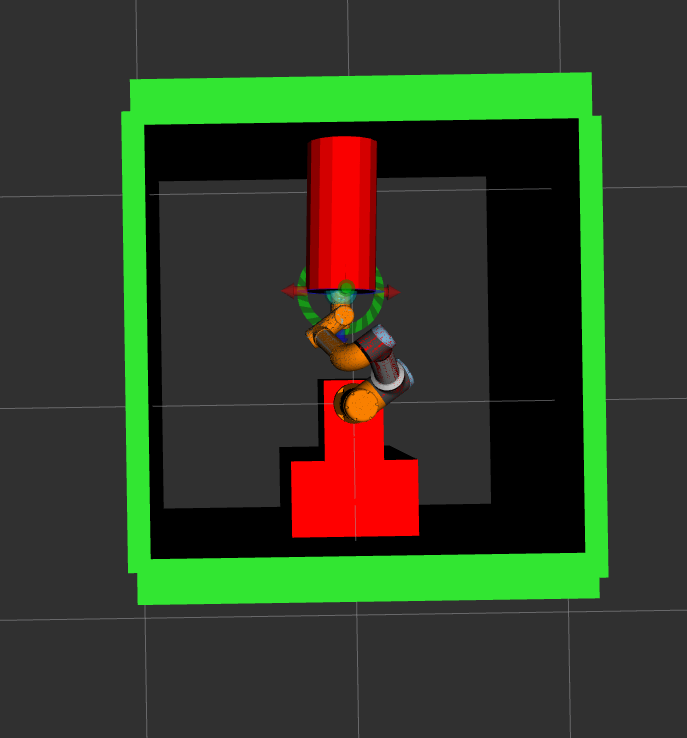

## Behavior tree - Task switching:

The tree diagram:

In this repo, we will use:
- [Universal_Robots_ROS2_Driver](https://github.com/UniversalRobots/Universal_Robots_ROS2_Driver/tree/galactic): the driver which provide all the action servers, services and topics.
- [Ursim](https://www.universal-robots.com/download/software-e-series/simulator-linux/offline-simulator-e-series-ur-sim-for-linux-5124/) install the ursim, for the online simulation.
- [Groot](https://github.com/BehaviorTree/Groot.git) : The graphical editor to design the BTs.
- [BehaviourTree.cpp](https://github.com/BehaviorTree/BehaviorTree.CPP/tree/v3.8)      library to execute BTs.(make sure to clone the package from branch **v3.8**, as Groot only supports v3.8 version.)

The main working principle of this tree:

Firsly, the robot scene for positioning is loaded and the robot moves to target position using Moveit2. Then the collision scene for drilling is loaded, The urscript is loaded and exceuted, then the robot is switched to remote mode and the collison scene for positioning is loaded. Finally it moves to home position using Moveit2.

Tree nodes:
- moveitcontrol: It is a service to switch the robot to remote mode.
- Loadscene: In this node, the collision scene is loaded and published using Moveit planningscene monitor.
- moveit: The robot is moved to target pose using Moveit2.move_group_interface.
- loadscript: It is a service to load the urscript with the desired parameters.
- execscript: It is a service to execute the urscript.
- iostatecondition: This node checks the digital ouput[1]. It is to make sure that the entire urscript is executed before switching to remote mode.(basically if the moveitcontrol node is ticked and the urscript is still running, it stops the execution of script as the robot is switched to remote mode)
- removescene: The entire collision scene and the objects are removed in this node.
- moveitjoints: the robot is moved to target joint positions using Moveit2.move_group_interface

## Urscript execution:

- Please check the SCRIPT_LOADING_README.md for instructions on how to load the parameters and multiple scripts.
- The ur_scripts folder contains some sample urscripts which you can execute. The custom_script_2.urscript is the sample script for robot drilling, custom_script_4.urscript is the script for simple linear movement of the arm. Keep the scripts to execute under ur_robot_driver/resources directory, If you would like to put the scripts in a seperate path, change the path for script laoding under ur.ros2_control.xacro. more detailed information is found in SCRIPT_LOADING_README.md.

The collsion_scenes folder contains the collsion scenes. testbench1.scene is the collision scene for the robot in the lab 139. please change the scene if there are new objects or if a collsion is occuring. Please change the file path of the collision scene to yours in the behavior tree.

## The desired Pose in base co-ordinates:

While setting target pose to Moveit2, The pose is given in base co-ordinates. the scripts/current_state.cpp gives you the current pose in base co-ordinates using /tf tree and also the joint states. please use this, if you are uncertain of the pose and joint states.

## IMPORTANT:

While giving pose goal to Moveit. please give the orientation (x, y,z,w quarternions) in 6 decimal places. If you give less than six decimal places, the robot wont reach the desired orientation.

## Executing tree without testbench urdf:

- Start the Ursim:
        
        ./start-ursim.sh UR16
- start the Ur ros2 driver:
         
         ros2 launch ur_bringup ur_control.launch.py ur_type:=ur16e robot_ip:=10.30.38.181 headless_mode:=true launch_rviz:=false        
- start Moveit2:

           ros2 launch ur_moveit_config ur_moveit.launch.py ur_type:=ur16e launch_rviz:=true
- Launch the behavior tree:

            ros2 launch fpm_handling_unit_script_switching bt_tree.launch.py

## Executing tree with testbench urdf:

- Start the Ursim:
        
        ./start-ursim.sh UR16
- start the Ur ros2 driver:
         
         ros2 launch ur_bringup ur_control.launch.py ur_type:=ur16e robot_ip:=10.30.33.209 description_file:=testbench_ur.urdf.xacro headless_mode:=true launch_rviz:=false        
- start Moveit2:

           ros2 launch ur_moveit_config ur_moveit.launch.py ur_type:=ur16e moveit_config_file:=bautiro.srdf.xacro description_file:=testbench_ur.urdf.xacro launch_rviz:=true
- Launch the behavior tree:

            ros2 launch fpm_handling_unit_script_switching bt_tree.launch.py