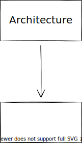

# Overview

This SW module contains functions to determine the fine pose of total station base on markers.

Real description

## Features

Coordination of fine localization:
Triangulation service:
Get rough position of markers:
Get target pose of target in robot arm frame:
Transform broadcaster for markers:

## Design
